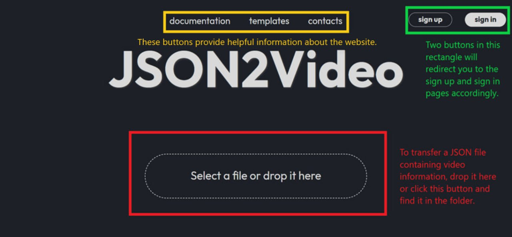
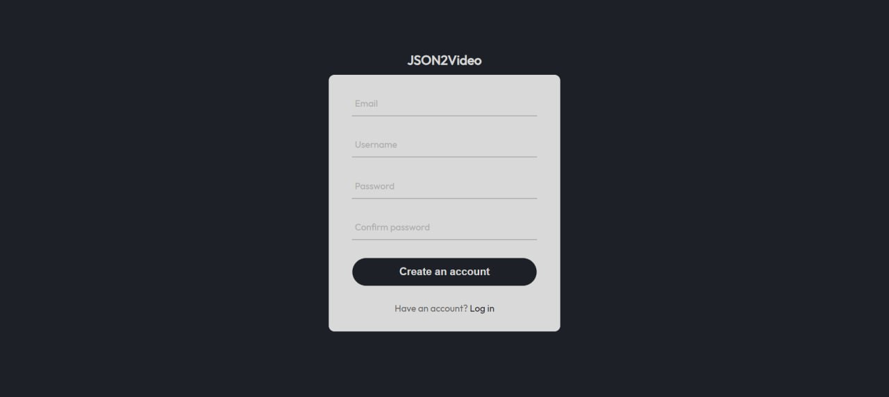
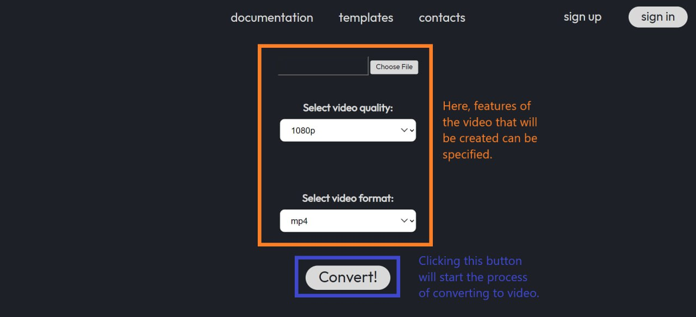
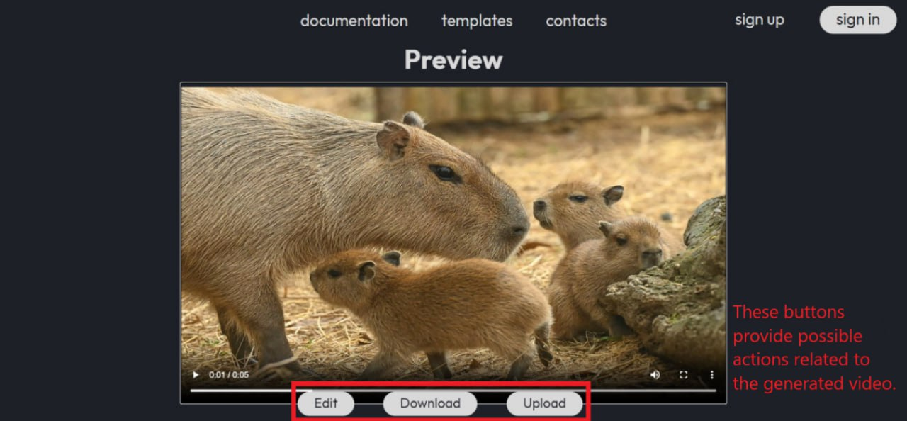
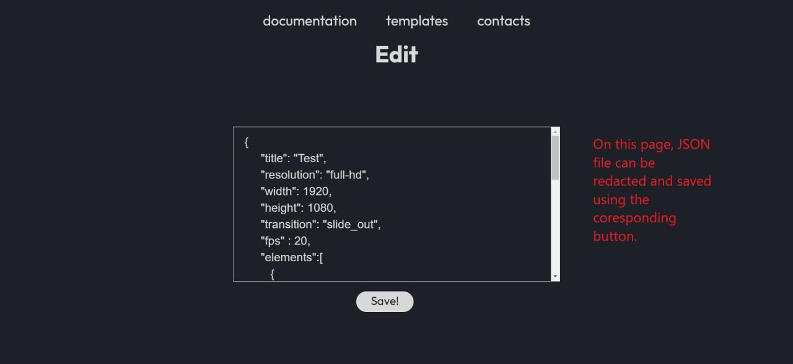

<a name="readme-top"></a>

# JSON2Video


<!-- TABLE OF CONTENTS -->
<details>
  <summary>Table of Contents</summary>
  <ol>
    <li><a href="#project-description">Project Description</a></li>
    <li><a href="#website-usage">Website usage</a></li>
    <li><a href="#how-to-use">How To Use</a></li>
    <li><a href="#features">Features</a></li>
    <li><a href="#project-installation">Project Installation</a></li>
    <li><a href="#technical-stack">Technical Stack</a></li>
    <li><a href="#badges">Badges</a></li>
    <li><a href="#team-and-contacts">Team And Contacts</a></li>
    <li><a href="#possible-future-work">Possible Future Work</a></li>
    <li><a href="#license">License</a></li>
  </ol>
</details>


## Project Description

<div dir="ltr">

You can access the website by [this link](http://json2video.ru/)

You can try to generate your own video on the website by using [testing JSON file](https://gitlab.pg.innopolis.university/software-project/json2video/-/blob/main/second.json)

The goal of this project is to create a website for converting a given JSON file into a short video and automatically uploading this generated video to a YouTube channel. The main functionality is based on a video generation algorithm that uses parameters given in a JSON file such as duration, set of photos/pictures, and so on.

<div dir="rtl">
<p align="right">(<a href="#readme-top">back to top</a>)</p>


## Website usage

<div dir="ltr">


<div dir="rtl">
<p align="right">(<a href="#readme-top">back to top</a>)</p>


## How To Use

<div dir="ltr">

1. **Main page:**



&nbsp;

2. **Sign in and sign up pages:**

*Both sign in and sign up pages can be used in order to write information about your account and log in to it or create the account*




&nbsp;

3. **Convert page:**



&nbsp;

4. **Preview page:**



&nbsp;

5. **Edit page:**



<div dir="rtl">
<p align="right">(<a href="#readme-top">back to top</a>)</p>


## Features

<div dir="ltr">


<div dir="rtl">
<p align="right">(<a href="#readme-top">back to top</a>)</p>


## Project Installation

<div dir="ltr">

How to install our project on your own machine or server (follow these steps, pasting a given lines into a terminal):

&nbsp;

**Step 1:**
```
git clone https://gitlab.pg.innopolis.university/software-project/json2video
```
This command will copy the source code of the project on your machine/server

&nbsp;

**Step 2:**
```
pip install -r requirenments.txt
```
This command will install the necessary python requirements

&nbsp;

**Step 3:**
```
sudo apt-get install imagemagick
```
This command will install a special ImageMagick library for the possibility to insert a text into a generated video

&nbsp;

**Step 4:**
```
sudo apt-get install ffmpeg
```
This command will install a special ffmpeg library for the rendering of the generated video

&nbsp;

**Step 5:**
```
python3 app.py
```
Using this command you can launch the application and, after that, start to use it


<div dir="rtl">
<p align="right">(<a href="#readme-top">back to top</a>)</p>


## Technical Stack

<div dir="ltr">

![JSON2Video Tech Stack](https://github-readme-tech-stack.vercel.app/api/cards?title=JSON2Video+Tech+Stack&titleAlign=center&lineHeight=2&lineCount=6&gap=0&width=250&line1=data%3Aimage%2Fsvg%2Bxml%3Bbase64%2CPHN2ZyB4bWxucz0iaHR0cDovL3d3dy53My5vcmcvMjAwMC9zdmciICB2aWV3Qm94PSIwIDAgNDggNDgiIHdpZHRoPSI0OHB4IiBoZWlnaHQ9IjQ4cHgiPjxwYXRoIGZpbGw9IiMwMjc3QkQiIGQ9Ik0yNC4wNDcsNWMtMS41NTUsMC4wMDUtMi42MzMsMC4xNDItMy45MzYsMC4zNjdjLTMuODQ4LDAuNjctNC41NDksMi4wNzctNC41NDksNC42N1YxNGg5djJIMTUuMjJoLTQuMzVjLTIuNjM2LDAtNC45NDMsMS4yNDItNS42NzQsNC4yMTljLTAuODI2LDMuNDE3LTAuODYzLDUuNTU3LDAsOS4xMjVDNS44NTEsMzIuMDA1LDcuMjk0LDM0LDkuOTMxLDM0aDMuNjMydi01LjEwNGMwLTIuOTY2LDIuNjg2LTUuODk2LDUuNzY0LTUuODk2aDcuMjM2YzIuNTIzLDAsNS0xLjg2Miw1LTQuMzc3di04LjU4NmMwLTIuNDM5LTEuNzU5LTQuMjYzLTQuMjE4LTQuNjcyQzI3LjQwNiw1LjM1OSwyNS41ODksNC45OTQsMjQuMDQ3LDV6IE0xOS4wNjMsOWMwLjgyMSwwLDEuNSwwLjY3NywxLjUsMS41MDJjMCwwLjgzMy0wLjY3OSwxLjQ5OC0xLjUsMS40OThjLTAuODM3LDAtMS41LTAuNjY0LTEuNS0xLjQ5OEMxNy41NjMsOS42OCwxOC4yMjYsOSwxOS4wNjMsOXoiLz48cGF0aCBmaWxsPSIjRkZDMTA3IiBkPSJNMjMuMDc4LDQzYzEuNTU1LTAuMDA1LDIuNjMzLTAuMTQyLDMuOTM2LTAuMzY3YzMuODQ4LTAuNjcsNC41NDktMi4wNzcsNC41NDktNC42N1YzNGgtOXYtMmg5LjM0M2g0LjM1YzIuNjM2LDAsNC45NDMtMS4yNDIsNS42NzQtNC4yMTljMC44MjYtMy40MTcsMC44NjMtNS41NTcsMC05LjEyNUM0MS4yNzQsMTUuOTk1LDM5LjgzMSwxNCwzNy4xOTQsMTRoLTMuNjMydjUuMTA0YzAsMi45NjYtMi42ODYsNS44OTYtNS43NjQsNS44OTZoLTcuMjM2Yy0yLjUyMywwLTUsMS44NjItNSw0LjM3N3Y4LjU4NmMwLDIuNDM5LDEuNzU5LDQuMjYzLDQuMjE4LDQuNjcyQzE5LjcxOSw0Mi42NDEsMjEuNTM2LDQzLjAwNiwyMy4wNzgsNDN6IE0yOC4wNjMsMzljLTAuODIxLDAtMS41LTAuNjc3LTEuNS0xLjUwMmMwLTAuODMzLDAuNjc5LTEuNDk4LDEuNS0xLjQ5OGMwLjgzNywwLDEuNSwwLjY2NCwxLjUsMS40OThDMjkuNTYzLDM4LjMyLDI4Ljg5OSwzOSwyOC4wNjMsMzl6Ii8%2BPC9zdmc%2B%2Cpython%2C%3B&line2=data%3Aimage%2Fsvg%2Bxml%3Bbase64%2CPHN2ZyB4bWxucz0iaHR0cDovL3d3dy53My5vcmcvMjAwMC9zdmciICB2aWV3Qm94PSIwIDAgNDggNDgiIHdpZHRoPSI0OHB4IiBoZWlnaHQ9IjQ4cHgiPjxwb2x5Z29uIGZpbGw9IiM0M2EwNDciIHBvaW50cz0iNDMsMzUuMTEyIDQzLDEzLjMzNiAyNCwyLjQ0NyA1LDEzLjMzNiA1LDM1LjExMiAyNCw0NiIvPjxwYXRoIGZpbGw9IiNmZmYiIGQ9Ik0zMi41LDEzYy0xLjM4MSwwLTIuNSwxLjExOS0yLjUsMi41djExLjI3NkwxOC45ODQsMTQuNDUzbC0wLjEzMS0wLjE1MiBDMTcuNjA5LDEyLjkzOCwxNi4xODcsMTMsMTUuNSwxM2MtMS4zODEsMC0yLjUsMS4xMTktMi41LDIuNXYxN2MwLDEuMzgxLDEuMTE5LDIuNSwyLjUsMi41czIuNS0xLjExOSwyLjUtMi41VjIxLjE0MSBsMTEuMjc4LDEyLjYyN2wwLjExLDAuMTQyQzMwLjYyLDM1LjEzMywzMi4yOTUsMzUsMzIuNSwzNWMxLjM4MSwwLDIuNS0xLjExOSwyLjUtMi41di0xN0MzNSwxNC4xMTksMzMuODgxLDEzLDMyLjUsMTN6Ii8%2BPC9zdmc%2B%2Cnginx%2C%3B&line3=data%3Aimage%2Fsvg%2Bxml%3Bbase64%2CPHN2ZyB4bWxucz0iaHR0cDovL3d3dy53My5vcmcvMjAwMC9zdmciIHZpZXdCb3g9IjAgMCAxMjggMTI4Ij48cGF0aCBmaWxsPSIjMzMzIiBkPSJNMTUuNjc2IDY5LjkxMmMtLjY3MS0uMTA3LTIuMzktLjUzNy0zLjgxMy0uOTI2TDkuMjcgNjguMjZsMS4zMy0yLjQ0NCAxLjMyOS0yLjQ0NC0xLjA3NC0xLjMzYy0xLjUxOC0xLjg4LTMuNDc4LTYuMDAyLTMuNDkxLTcuMzMtLjAxNC0zLjEwMyA0LjAxNC03LjYwMSA4Ljk1Ni0xMC4wMTggMy4zOTctMS42NjUgNi4wOTYtMS43MDUgOS40OC0uMTJsMi41NTEgMS4xOTQuNzM5LTEuMDZjLjQwMi0uNTc4LjczOC0xLjM0My43MzgtMS42NzlzLjMzNi0uNjMxLjczOS0uNjMxLjczOC4xMDcuNzM4LjIyOGMwIC4yOTYtMi45NjcgNy43ODgtMy4xNTUgNy45NzYtLjA4MS4wOC0uODg3LS4yOTUtMS44LS44MzItMi41NzgtMS41MTgtNS44MTQtMi41MjUtOC4zMjUtMi41OTItNS44NDEtLjE0OC03Ljg2OSA1LjU2LTMuNzQ2IDEwLjU1NGwxLjQ1IDEuNzYgMy45NjEtMy4yMWM0LjQ0NS0zLjU4NSA0Ljk1NS0zLjY2NiA4LjQyLTEuMjc1IDMuODkzIDIuNjg1IDMuOTYgNi43NjcuMiAxMS4wMzctMy4zMyAzLjgtNi43NTMgNC44NDgtMTIuNjM1IDMuODY3em05Ljk2NC00LjA5NWMxLjkzMy0xLjUxNyAxLjc5OS00LjMyNC0uMjk2LTYuNTUzLTIuNjMyLTIuNzkzLTMuNDUtMi42NzItOC4wODMgMS4xOTUtNC42MDYgMy44NC00LjYzMyAzLjY5My44NzMgNS40NTIgMy42MzggMS4xODEgNS45MjEgMS4xNDEgNy41MDYtLjA5NHpNNjMuMDUgODAuNjE0Yy0xLjMxNy0uNDgzLTQuODYyLTEuOTQ3LTcuODk2LTMuMjYzLTguMTkxLTMuNTcyLTkuMzQ2LTMuNjM5LTExLjc5LS42NzEtLjU2NC42ODUtMS4xODEgMS4xMTQtMS4zNTYuOTQtLjUyNC0uNTI0IDEuMDM0LTMuMDM1IDIuOTE0LTQuNjg2IDEuNTMtMS4zNDMgMi4wNC0xLjUzMSAzLjczMy0xLjM0MyAxLjA3NC4xMiA0LjY0NiAxLjM3IDcuOTM1IDIuNzY2IDcuNDI2IDMuMTU1IDkuNjAxIDMuODI3IDEyLjQzNSAzLjgyNyAzLjQ1IDAgNS4yMjMtMi40MTcgNC4xMzUtNS42MjYtLjI2OC0uODA2LS4xODgtMS4wNzUuMzUtMS4wNzUgMS4wMDYgMCAxLjUxNyAzLjc2Ljc5MiA1LjkyMi0uMzEuOTI2LTEuMjA5IDIuMjQyLTIuMDAxIDIuOS0xLjE4Mi45OTQtMS45MzQgMS4yMDktNC4xNSAxLjE5NS0xLjQ5LS4wMTMtMy43ODYtLjQwMi01LjEwMi0uODg2em0tMTkuMTM1LTExLjQ4Yy0zLjA0OC0xLjQyNC01LjgwMS00LjEzNi03LjM4Ni03LjMwNS0yLjUzNy01LjA3Ni0xLjc1OS04LjMyNSAzLjA0OS0xMi43MTYgNC4wNDEtMy42OTMgNy4zNDUtNS4xMyAxMS43OS01LjEzIDMuMjA4IDAgMy44OTMuMTc1IDUuOTc0IDEuNDUgNC45MjggMy4wNDkgNi4xNSA4Ljg2MyAzLjE4MyAxNS4yLTMuNDc4IDcuNDQtMTAuODIzIDExLjE4Ni0xNi42MSA4LjV6bTEwLjIwNS0zLjUzMmMyLjI4Mi0xLjEyOCAzLjg1NC02LjMzOCAzLjIwOS0xMC42NjItLjgwNi01LjMzLTguMDE2LTguOTctMTMuMzA3LTYuNzEzLTUuNDM4IDIuMzIzLTUuNTE5IDguNTEzLS4xNzQgMTQuMDg1IDMuNzMyIDMuOTA4IDYuOTQyIDQuOTI4IDEwLjI3MiAzLjI5ek02NC40NzMgNzAuMTE0YzAtLjIyOS44NDUtLjYzMSAxLjg5My0uODg3bDEuODkzLS40Ny40MDMtNi44MmMuNDQzLTcuNTQ3LjEyLTE0Ljk3My0uNjk4LTE1Ljk2Ni0uMjk2LS4zNS0xLjE5NS0uNzgtMi4wMTQtLjk2Ny0zLjMzLS43MzktMS4xMTUtMS4yNDkgNS4zNDQtMS4yNDkgNi40NTkgMCA4LjUxMy40NyA1LjQzOCAxLjI0OS0yLjY0NS42NTgtMi42NTkuNjk4LTIuNjU5IDExLjQ2NyAwIDUuOTc1LjIxNSAxMC40NzQuNTI0IDExLjA1MS40My44MDYgMS4wNzQuOTggMy41NDUuOTggNS4xMDIgMCA2Ljg2MS0xLjIwOCA4LjI0NS01LjY4LjQxNi0xLjM0MiAxLjQ5LTEuMSAxLjExNC4yNTYtLjE3NS42My0uNDU2IDIuNTUtLjYzMSA0LjI5NmwtLjMyMiAzLjE1Nkg3NS41MWMtNi4wNyAwLTExLjAzNy0uMTg4LTExLjAzNy0uNDE2eiIvPjxwYXRoIGZpbGw9IiNjYTI3MjciIGQ9Ik04OS41NDIgNjkuNzkxYzAtLjQwMi4zOS0uODA1IDEuMDM0LTEuMTE0Ljg2LS40MDMgMS40MjMtMS4yNDkgMy40NjQtNS4yMzcgMy4yMzYtNi4zMSA4LjMzOS0xNy4xNDcgOC44MjItMTguNzcyLjM3Ni0xLjIzNS40NTctMS4zMDIgMS44NTMtMS40NjMuODA2LS4wOTQgMS40NzctLjE0OCAxLjQ5LS4xMjEuMDE0LjAyNyAxLjEyOSAyLjQ3IDIuNDg1IDUuNDM4IDEuMzQzIDIuOTY3IDQuMDQyIDguNjA3IDYuMDAyIDEyLjUyOCAzLjI3NyA2LjU5MyAzLjY0IDcuMTg0IDQuNzQgNy43Mi42NzIuMzIzIDEuMTk1LjgyIDEuMTk1IDEuMTE1IDAgLjQ3LS41NzcuNTI0LTUuNTQ1LjUyNC00Ljk4MiAwLTUuNTQ2LS4wNTQtNS41NDYtLjUzNyAwLS4zMjIuNDMtLjY3MSAxLjExNC0uOS42MzItLjIwMSAxLjExNS0uNTc3IDEuMTE1LS44NTkgMC0uMjY5LS42NTgtMi4wNDEtMS40NjQtMy45MzRsLTEuNDYzLTMuNDUxSDk3Ljc0NmwtMS4wNiAyLjMzNmMtMS45ODggNC4zNzgtMi4wMjggNS40MTItLjE3NSA1LjkwOC45MjcuMjU1IDEuMTgyLjQ1NyAxLjA3NC44NzMtLjEyLjQ4NC0uNjA0LjU1LTQuMDk1LjU1LTMuNzQ3LjAyOC0zLjk0OCAwLTMuOTQ4LS42MDR6bTE4LjE4MS0xMC44NjNjLjE4OC0uMzM1LTMuOTg4LTkuNDUzLTQuMzc3LTkuNTQ3LS4yODItLjA4LTQuNjA2IDguODM2LTQuNjA2IDkuNTA3IDAgLjMzNiA4Ljc4Mi4zNzYgOC45ODMuMDR6Ii8%2BPC9zdmc%2B%2CSQLAlchemy%2C%3B&line4=data%3Aimage%2Fsvg%2Bxml%3Bbase64%2CPHN2ZyB4bWxucz0iaHR0cDovL3d3dy53My5vcmcvMjAwMC9zdmciICB2aWV3Qm94PSIwIDAgNDggNDgiIHdpZHRoPSI0OHB4IiBoZWlnaHQ9IjQ4cHgiPjxwYXRoIGZpbGw9IiNFNjUxMDAiIGQ9Ik00MSw1SDdsMywzNGwxNCw0bDE0LTRMNDEsNUw0MSw1eiIvPjxwYXRoIGZpbGw9IiNGRjZEMDAiIGQ9Ik0yNCA4TDI0IDM5LjkgMzUuMiAzNi43IDM3LjcgOHoiLz48cGF0aCBmaWxsPSIjRkZGIiBkPSJNMjQsMjV2LTRoOC42bC0wLjcsMTEuNUwyNCwzNS4xdi00LjJsNC4xLTEuNGwwLjMtNC41SDI0eiBNMzIuOSwxN2wwLjMtNEgyNHY0SDMyLjl6Ii8%2BPHBhdGggZmlsbD0iI0VFRSIgZD0iTTI0LDMwLjl2NC4ybC03LjktMi42TDE1LjcsMjdoNGwwLjIsMi41TDI0LDMwLjl6IE0xOS4xLDE3SDI0di00aC05LjFsMC43LDEySDI0di00aC00LjZMMTkuMSwxN3oiLz48L3N2Zz4%3D%2Chtml%2C%3B&line5=data%3Aimage%2Fsvg%2Bxml%3Bbase64%2CPHN2ZyB4bWxucz0iaHR0cDovL3d3dy53My5vcmcvMjAwMC9zdmciICB2aWV3Qm94PSIwIDAgNDggNDgiIHdpZHRoPSI0OHB4IiBoZWlnaHQ9IjQ4cHgiPjxwYXRoIGZpbGw9IiMwMjc3QkQiIGQ9Ik00MSw1SDdsMywzNGwxNCw0bDE0LTRMNDEsNUw0MSw1eiIvPjxwYXRoIGZpbGw9IiMwMzlCRTUiIGQ9Ik0yNCA4TDI0IDM5LjkgMzUuMiAzNi43IDM3LjcgOHoiLz48cGF0aCBmaWxsPSIjRkZGIiBkPSJNMzMuMSAxM0wyNCAxMyAyNCAxNyAyOC45IDE3IDI4LjYgMjEgMjQgMjEgMjQgMjUgMjguNCAyNSAyOC4xIDI5LjUgMjQgMzAuOSAyNCAzNS4xIDMxLjkgMzIuNSAzMi42IDIxIDMyLjYgMjF6Ii8%2BPHBhdGggZmlsbD0iI0VFRSIgZD0iTTI0LDEzdjRoLTguOWwtMC4zLTRIMjR6IE0xOS40LDIxbDAuMiw0SDI0di00SDE5LjR6IE0xOS44LDI3aC00bDAuMyw1LjVsNy45LDIuNnYtNC4ybC00LjEtMS40TDE5LjgsMjd6Ii8%2BPC9zdmc%2B%2Ccss%2C%3B&line6=data%3Aimage%2Fsvg%2Bxml%3Bbase64%2CPD94bWwgdmVyc2lvbj0iMS4wIiBlbmNvZGluZz0idXRmLTgiPz48IS0tIFVwbG9hZGVkIHRvOiBTVkcgUmVwbywgd3d3LnN2Z3JlcG8uY29tLCBHZW5lcmF0b3I6IFNWRyBSZXBvIE1peGVyIFRvb2xzIC0tPgo8c3ZnIGZpbGw9IiMwMDAwMDAiIHdpZHRoPSI4MDBweCIgaGVpZ2h0PSI4MDBweCIgdmlld0JveD0iMCAwIDI0IDI0IiBpZD0iZmxhc2stMyIgZGF0YS1uYW1lPSJGbGF0IExpbmUiIHhtbG5zPSJodHRwOi8vd3d3LnczLm9yZy8yMDAwL3N2ZyIgY2xhc3M9Imljb24gZmxhdC1saW5lIj48cGF0aCBpZD0ic2Vjb25kYXJ5IiBkPSJNMTgsMjFINmExLDEsMCwwLDEtLjg4LTEuNDdMMTAsMTAuNDZWM2g0djcuNDZsNC44OCw5LjA3QTEsMSwwLDAsMSwxOCwyMVoiIHN0eWxlPSJmaWxsOiByZ2IoNDQsIDE2OSwgMTg4KTsgc3Ryb2tlLXdpZHRoOiAyOyI%2BPC9wYXRoPjxwYXRoIGlkPSJwcmltYXJ5IiBkPSJNMTgsMjFINmExLDEsMCwwLDEtLjg4LTEuNDdMMTAsMTAuNDZWM2g0djcuNDZsNC44OCw5LjA3QTEsMSwwLDAsMSwxOCwyMVpNOSwzaDYiIHN0eWxlPSJmaWxsOiBub25lOyBzdHJva2U6IHJnYigwLCAwLCAwKTsgc3Ryb2tlLWxpbmVjYXA6IHJvdW5kOyBzdHJva2UtbGluZWpvaW46IHJvdW5kOyBzdHJva2Utd2lkdGg6IDI7Ij48L3BhdGg%2BPC9zdmc%2B%2Cflask%2C%3B)

<div dir="rtl">
<p align="right">(<a href="#readme-top">back to top</a>)</p>


## Badges

<div dir="ltr">


<div dir="rtl">
<p align="right">(<a href="#readme-top">back to top</a>)</p>


## Possible Future Work

<div dir="ltr">

“For customer”

1. The JSON parser could take more detailed and varied JSON files, which will provide more functionality

2. Additional parameters for a generated video will provide a more comfortable and enjoyable user experience

3. Depending on the demand for the product, there is a possibility of increasing the YouTube API quota (number of posted videos per day)

4. Connection with AI or ML systems for generating images according to the given text

<div dir="rtl">
<p align="right">(<a href="#readme-top">back to top</a>)</p>


## License

<div dir="ltr">

Distributed under the MIT License. See [LICENSE.txt](https://gitlab.pg.innopolis.university/software-project/json2video/-/blob/main/LICENSE.txt) for more information.

<div dir="rtl">
<p align="right">(<a href="#readme-top">back to top</a>)</p>


